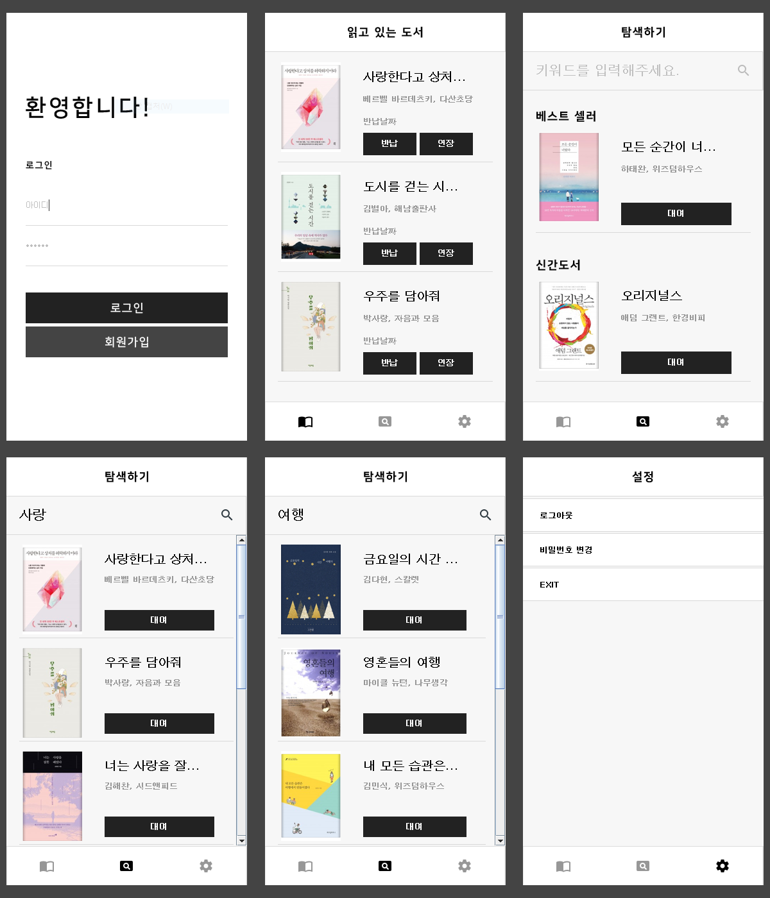

### AirBooks: 도서 관리 프로그램

## 개요
스마트하게 도서관을 이용할 수 있게 도와주는 특별한 프로그램입니다.
대여 가능한 도서인지, 혹은 다른 독자가 대여 중인지를 미리 확인하면서 방문 전에도 원하는 책을 빠르게 대여할 수 있습니다.
다양한 도서 추천과 검색 기능을 통해 원하는 책을 쉽게 찾아볼 수 있습니다.
또한, 사용자의 독서 습관을 관리하기 위해 도서 대여 및 반납을 자동으로 기록합니다.

## 설치 및 실행 방법
> airbooks 폴더에 유저, 책에 대한 데이터 파일이 포함되어 있습니다.
> 사용자 폴더에 옮기셔야 정상적으로 작동합니다.

## 주요 기능
- 도서를 검색합니다.
- 도서의 대여 상태를 확인합니다.
- 도서를 대여하고 반납합니다.
- 대여중인 도서를 연장합니다.
- 독서 활동을 트래킹합니다.

## 기술 스택
- **언어**
  - Java
- **라이브러리**
  - Java File I/O
  - AWT
  - Swing
- **IDE**
  - Eclipse

## 라이선스
Copyright © 2019. [EGO CREW](https://ego.so/). All rights reserved.
